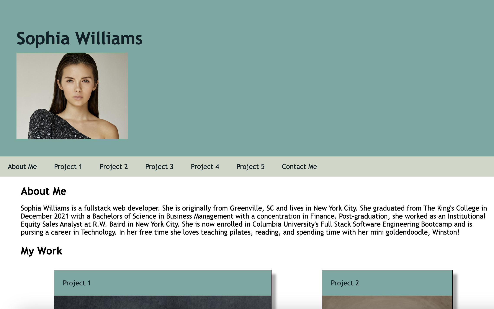
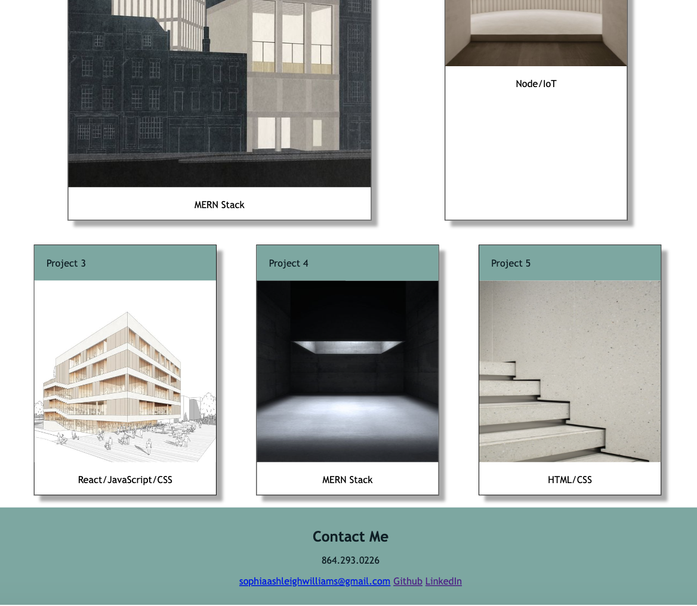

# Sophia-Williams-Portfolio
My name is Sophia Williams and I am a web developer! I've developed a website to present five of my best projects in a concise and easily accessible format. Take a look at my work! 

https://sophiawilliams16.github.io/sophia-williams-portfolio/

## Table of Contents

- [Installation](#installation)
- [Usage](#usage)
- [Credits](#credits)
- [License](#license)
- [Badges](#badges)

## Installation

To install the project, download the files from my Github repository here: https://github.com/sophiawilliams16/sophia-williams-portfolio

and open the project in VS Code. 

## Usage

To visit my site, click here: https://sophiawilliams16.github.io/sophia-williams-portfolio/ 

## Credits

Sources: 
1. Used 02-Advanced-CSS-HTML Activity 26 as a template to hand-code the structure of the html and CSS pages 
2. Mailto link html https://www.w3docs.com/snippets/html/how-to-create-mailto-links.html 
3. Coolors color palette: https://coolors.co/user/palettes/64866ca584af9f000c8a3ebd 
4. Resizing photos: https://stackoverflow.com/questions/5969114/how-do-i-make-an-image-smaller-with-css 
5. Hash links: https://css-tricks.com/a-complete-guide-to-links-and-buttons/ 
6. Smooth Scroll: https://css-tricks.com/snippets/jquery/smooth-scrolling/
7. Office Hours with Charlie to help with aligning flexboxes. 
8. README File Formatting: https://coding-boot-camp.github.io/full-stack/github/professional-readme-guide 

Image Sources: 
1. "Arch" https://www.pinterest.com/pin/457889487128664920/
2. "Building" https://www.pinterest.com/pin/457889487128789521/ 
3. "Render" https://www.pinterest.com/pin/132645151518409897/ 
4. "Skylight" https://www.pinterest.com/pin/457889487128663377/ 
5. "Stairs" https://www.pinterest.com/pin/457889487128664933/

## License
MIT License

Copyright (c) 2023 Sophia Williams

Permission is hereby granted, free of charge, to any person obtaining a copy
of this software and associated documentation files (the "Software"), to deal
in the Software without restriction, including without limitation the rights
to use, copy, modify, merge, publish, distribute, sublicense, and/or sell
copies of the Software, and to permit persons to whom the Software is
furnished to do so, subject to the following conditions:

The above copyright notice and this permission notice shall be included in all
copies or substantial portions of the Software.

THE SOFTWARE IS PROVIDED "AS IS", WITHOUT WARRANTY OF ANY KIND, EXPRESS OR
IMPLIED, INCLUDING BUT NOT LIMITED TO THE WARRANTIES OF MERCHANTABILITY,
FITNESS FOR A PARTICULAR PURPOSE AND NONINFRINGEMENT. IN NO EVENT SHALL THE
AUTHORS OR COPYRIGHT HOLDERS BE LIABLE FOR ANY CLAIM, DAMAGES OR OTHER
LIABILITY, WHETHER IN AN ACTION OF CONTRACT, TORT OR OTHERWISE, ARISING FROM,
OUT OF OR IN CONNECTION WITH THE SOFTWARE OR THE USE OR OTHER DEALINGS IN THE
SOFTWARE.

## Badges

